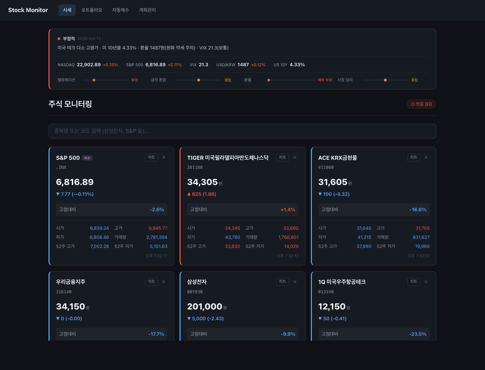

# Stock Monitor

한국 주식(KRX) + 해외지수 실시간 모니터링 웹앱. 한국투자증권 / 키움증권 API로 자신의 포트폴리오를 조회하고 자동매수 규칙을 설정할 수 있습니다.



## 주요 기능

### 시세 모니터링
- 국내주식 + 해외지수 실시간 시세 (WebSocket, 5초 간격)
- 관심종목 관리 (DB 영구 저장)
- 캔들차트 + 거래량 (기간 선택: 1M / 3M / 6M / 1Y)
- 52주 고점대비 등락률
- 종목 관련 뉴스
- 매입평균가 차트 라인 (보유 종목)

### 포트폴리오
- 멀티 계좌 포트폴리오 집계 (한국투자증권 / 키움증권)
- 전 계좌 합산 총자산 + 계좌별 카드 → 보유종목 상세
- 계좌 유형별 자동 API 분기 (위탁/연금저축/퇴직연금/ISA)

### 자동매수
- 스케줄: 매일 / 매주(요일 선택, N주 간격) / 매월(N일)
- 트리거 조건: 항상 / 목표가 이하 / 전일대비 N% 하락 / 52주 고점대비 N% 하락
- 실행 윈도우 시간대 설정 (예: 09:00~15:30)
- 모드: 자동 주문 / 알림만
- 주문 유형: 시장가 / 지정가 (고정가, 현재가 할인율)
- 금액 전략: 고정 금액 / 예수금 비율

### 시장 인사이트
- 매일 자동 수집 (08:00 KST cron): NASDAQ, S&P 500, VIX, USD/KRW, 미국 10년물 금리
- 밸류에이션 / 금리 환경 / 환율 / 시장 심리 스코어링 (-2 ~ +2)
- 종합 시그널 (긍정/중립/부정) 대시보드 상단 배너

### 알림
- 매수 시점 알림, 체결 성공/실패 알림
- 알림벨 UI (읽지 않은 알림 뱃지)

## 요구사항
- Node.js 20+
- Docker (KIS Trading MCP 사용 시)
- 한국투자증권 또는 키움증권 OpenAPI 앱키

## 설치

```bash
git clone https://github.com/YOUR_USERNAME/stock-monitor.git
cd stock-monitor

# 백엔드
cd server
npm install
cp .env.example .env
npm run start:dev

# 프론트엔드 (새 터미널)
cd client
npm install
npm run dev
```

브라우저에서 http://localhost:5173 접속.

## 설정

1. `/accounts` 페이지에서 증권사 앱키 등록 (한투/키움)
2. `/` 대시보드에서 종목 검색 → 관심종목 추가
3. `/portfolio` 에서 멀티계좌 포트폴리오 집계 확인
4. `/auto-buy` 에서 자동매수 규칙 설정 (스케줄/트리거/금액)
5. 시장 인사이트는 매일 08:00 KST에 자동 생성 (대시보드/포트폴리오 상단)

## KIS Trading MCP 연동 (선택)

자동매매를 Claude Desktop/Code 에서 사용하려면:

```bash
# 프로젝트 외부에 별도 클론
git clone https://github.com/koreainvestment/open-trading-api.git mcp/kis-trading

cd "mcp/kis-trading/MCP/Kis Trading MCP"
cp .env.example .env  # 내 앱키 채우기
docker build -t kis-trade-mcp .
docker run -d --name kis-trade-mcp -p 3000:3000 --env-file .env -e MCP_TYPE=sse kis-trade-mcp

# Claude Code에 MCP 등록
claude mcp add kis-trade-mcp --transport sse http://localhost:3000/sse -s user
```

## 보안 주의사항

⚠️ **절대 하지 말아야 할 것:**
- `.env` 파일을 Git에 커밋하지 마세요
- `server/data/*.db` 파일을 공개 저장소에 올리지 마세요
- 앱키/시크릿을 스크린샷에 포함하지 마세요
- 본인 외의 제3자에게 앱키를 공유하지 마세요

앱키가 유출되면 즉시 [KIS 개발자센터](https://apiportal.koreainvestment.com/) 에서 재발급하세요.

## 기술 스택
- **Frontend**: React + Vite + TypeScript, lightweight-charts, React Query, Socket.IO
- **Backend**: NestJS + TypeScript, TypeORM + SQLite
- **Data**: 네이버 증권 API (시세), KIS/키움 REST API (계좌)

## 라이선스
MIT

## 면책
본 프로젝트는 개인 학습/연구 목적입니다. 실제 투자로 인한 손실에 대해 개발자는 책임지지 않습니다. 자동매매 사용 전 반드시 모의투자로 충분히 검증하세요.
